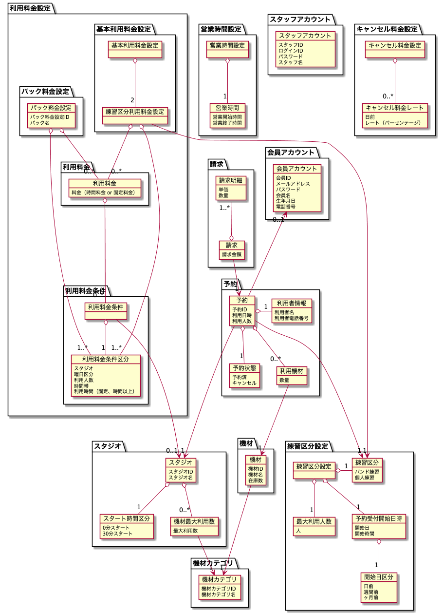

# 概要
スタジオ予約を題材とした DDD の練習プロジェクトです。

要件定義は RADRA 2.0 を参考にしています。

# システムコンテキスト

# 要求モデル
## 要望

## 要件
* スタジオ、機材の空き状況を確認できること。
* スタジオ、機材を予約できること。

# ビジネスコンテキスト・ビジネスユースケース
## 予約（ビジネスコンテキスト）

* 利用者が Web で会員登録する「会員登録」。
* 利用者が Web で予約する「Web予約」。
* 利用者が電話で予約する「電話予約」。（スタッフが Web 予約を代行する。）
* 利用者が店頭で直接予約する「店頭予約」。(スタッフが Web 予約を代行する。）

## 設備管理（ビジネスコンテキスト）

* 管理者がスタッフの管理を行う「スタッフ管理」。
* 管理者がスタジオの管理を行う「スタジオ管理」。
* 管理者が機材の管理を行う「機材管理」。
* 管理者が利用料金の管理を行う「利用料金管理」。

## スタジオ利用（ビジネスコンテキスト）

* スタッフが機材貸出や転換などを行う「スタジオ準備」。
* 利用者がスタジオで練習する「スタジオ利用」。
* 利用者が支払いを行う「会計」。

＜補足＞
* 練習中に追加で機材を借りることもある。
* スタッフは会計の際に機材が全て返却されていることを確認する。

# 業務フロー
- ユースケースを洗い出すために、ビジネスユースケースごとに業務フロー図を作成する。

今回は省略。

# サイト構成

# ユースケース
## 予約（ビジネスコンテキスト）
### 会員登録

### Web 予約

### 電話予約

### 店頭予約

## 設備管理（ビジネスコンテキスト）
### スタッフ管理

### スタジオ管理

### 機材管理

### 利用料金管理

# 画面設計
- 作るものをイメージしやすくするために画面のラフ画を作る。
- ユースケースを満たすように作っていく。

# ドメインモデル
- ドメインモデル図とビジネスルールをまとめていく。

## ドメインモデル図

## 用語集
- ドメインに登場する概念とそれが何を示すかの説明をまとめ、開発者間で認識齟齬が生まれないようにする。（ユビキタス言語を定義する。）

## ビジネスルール
### 予約
- 予約時間の単位は 1 時間
- スタジオごとにスタート時間（0 分スタート、30 分スタート）が決まる
- 練習区分としてバンド練習と個人練習がある。
- 個人練習の最大利用人数は 2 名まで。
- 練習区分ごとに予約受付開始日時が決まる。（個人練習は前日 21 時から、バンド練習は 2 ヶ月前からなど。）
- スタジオごとに各機材種別の最大利用数を決められる。
- 営業時間を超えた予約を行うことはできない。

##### 会員による Web でのキャンセル
- キャンセル料金がかからない場合のみ可能。
  - キャンセルしたい場合は電話するしかない。
- 利用開始日時を過ぎている場合は不可。

##### スタッフによるキャンセル（管理サイトでのキャンセル）
- TODO

#### 予約の変更について
##### 会員による Web での予約変更
- 利用スタジオ、利用日時、練習区分は、キャンセル料がかからない場合のみ変更可能。
  - 変更したい場合は電話でキャンセルしてから新たに予約するしかない。
- 利用機材、利用人数は、いつでも変更可能。
- 利用者情報は、変更不可能。（会員情報と連携しているためそもそも入力の必要がない。）
- 利用開始日時を過ぎている場合は全て変更不可。

##### スタッフによる予約変更（管理サイトでの予約変更）
- TODO

### 会員アカウント
- ログインID とパスワードでシステムにログインする。
- パスワードは 8 文字以上 16 文字以内で、半角英数記号がそれぞれ 1 文字以上含まれていなければならない。
- ログインID の重複は許さない。

### スタッフアカウント
- メールアドレスとパスワードでシステムにログインする。
- パスワードは 8 文字以上 16 文字以内で、半角英数記号がそれぞれ 1 文字以上含まれていなければならない。
- メールアドレス の重複は許さない。

### 利用料金設定
- 基本料金、パック料金、キャンセル料金を設定できる。
- 基本料金について
  - 練習区分ごとに設定できる。
  - 条件として、スタジオ、曜日、時間帯、を指定できる。
- パック料金について
  - バンド練習にのみ適用可能。
- キャンセル料金について
  - 利用日の何日前から何%といったように決められる。
  - 最大 50 日前まで指定可能。

#### 料金例
##### バンド練習
|スタジオ|曜日区分|10 - 19|19 - 10|
|---|---|---|---|
|Studio A（9 畳）|平日|￥1,000/1h|￥1,500/1h|
||土日祭|￥1,500/1h|￥1,500/1h|
|Studio B（13 畳）|平日|￥1,200/1h|￥1,700/1h|
||土日祭|￥1,700/1h|￥1,700/1h|
|Studio C（15 畳）|平日|￥1,400/1h|￥1,900/1h|
||土日祭|￥1,900/1h|￥1,900/1h|
|Studio D（20 畳）|平日|￥2,000/1h|￥2,500/1h|
||土日祭|￥2,500/1h|￥2,500/1h|

##### 個人練習
|人数|曜日区分|10 - 19|19 - 10|
|---|---|---|---|
|1 名|平日|￥500/1h|￥700/1h|
||土日祭|￥700/1h|￥700/1h|
|2 名|平日|￥800/1h|￥1,000/1h|
||土日祭|￥1,000/1h|￥1,000/1h|

##### デイパック
|スタジオ|曜日区分|利用時間|10 - 19|
|---|---|---|---|
|Studio A（9 畳）|平日|3h 以上|￥900/1h|
|Studio B（13 畳）|平日|3h 以上|￥1,000/1h|
|Studio C（15 畳）|平日|3h 以上|￥1,200/1h|
|Studio D（20 畳）|平日|3h 以上|￥1,400/1h|

##### オールナイトパック
|スタジオ|曜日区分|利用時間|23 - 10|
|---|---|---|---|
|全スタジオ|全日|3h 以上|￥4,000|
|全スタジオ|全日|4h 以上|￥5,000|
|全スタジオ|全日|5h 以上|￥6,000|
|全スタジオ|全日|6h 以上|￥7,000|

##### キャンセル料金
| 条件 | キャンセル料金レート |
| --- | --- | --- |
| 1 週間前（7 日前）から | 20 % |
| 前日（1 日前）から | 50 % |
| 当日（0 日前）から | 100 % |

# レイヤー構造（バックエンド）
バックエンドの各サービスのレイヤー構造は基本的に以下の構造とする。

## api 層
* API を提供する Controller を配置する。

## usecase 層
* データ登録/更新系の CommandService とデータ参照系の QueryService に別れる。

**＜CommandService＞**
* domain 層の DomainObject を利用してユースケースを実現する。

**＜QueryService＞**
* 画面に特化した形式でデータを取得するためのインターフェース。

## domain 層
* ドメインモデルを表現したもの。
* DomainObject を永続領域から取得、永続化を行うための Repository（インターフェース）を配置する。

## infrastructure 層
* データベースや特定の技術に依存した処理が行われる。
* domain 層の Repository の実装クラスを配置し、DomainObject と永続領域間の変換を行う。
* usecase 層の QueryService の実装クラスを配置し、永続領域から画面に特化した形式でデータを取得する。

# TODO
* パック料金計算。
* 学生のディスカウント。（10 % OFFなど。）

# 参考
* [PlantUML Example for RDRA 2.0 ハンドブック](https://qiita.com/ogomr/items/97058a87337eaa2ba21a)
* [現場で役立つシステム設計の原則](https://www.amazon.co.jp/%E7%8F%BE%E5%A0%B4%E3%81%A7%E5%BD%B9%E7%AB%8B%E3%81%A4%E3%82%B7%E3%82%B9%E3%83%86%E3%83%A0%E8%A8%AD%E8%A8%88%E3%81%AE%E5%8E%9F%E5%89%87-%E5%A4%89%E6%9B%B4%E3%82%92%E6%A5%BD%E3%81%A7%E5%AE%89%E5%85%A8%E3%81%AB%E3%81%99%E3%82%8B%E3%82%AA%E3%83%96%E3%82%B8%E3%82%A7%E3%82%AF%E3%83%88%E6%8C%87%E5%90%91%E3%81%AE%E5%AE%9F%E8%B7%B5%E6%8A%80%E6%B3%95-%E5%A2%97%E7%94%B0-%E4%BA%A8/dp/477419087X)

# 気づき
## ファーストクラスコレクション
- ファーストクラスコレクション自体も不変にする。（内部も ValueObject にする。）
  - Entity をファーストクラスコレクションにしたい場合はどうする？
- ファーストクラスコレクションのバリデーションは、集約ルートに任せた方が良いと思う。つまり、ファーストクラスコレクションのコンストラクタでのバリデーションは行わない。
  - 例えば、重複を排除すると行ったバリデーションはコンストラクタでは行わない。
  - 一つの ValueObject 集約に対するメソッド呼び出しで、複数のバリデーション結果を返したい場合が