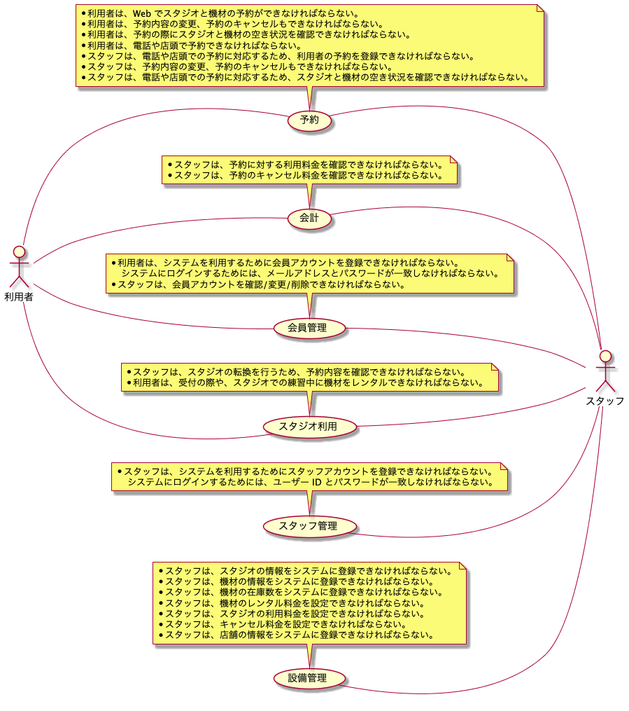
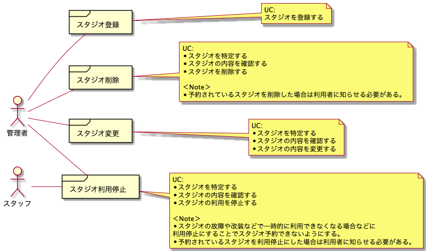
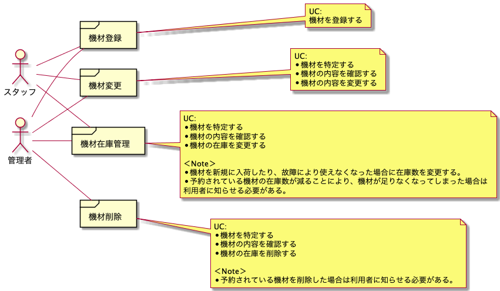
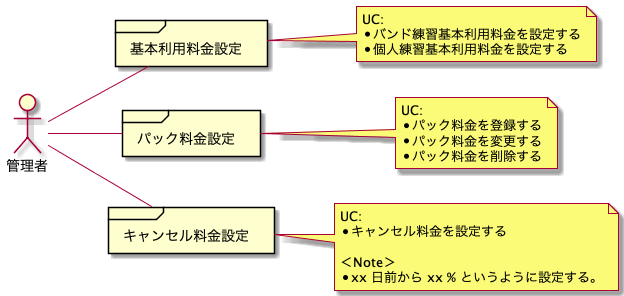
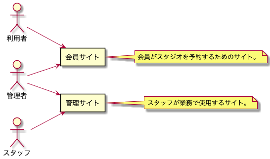
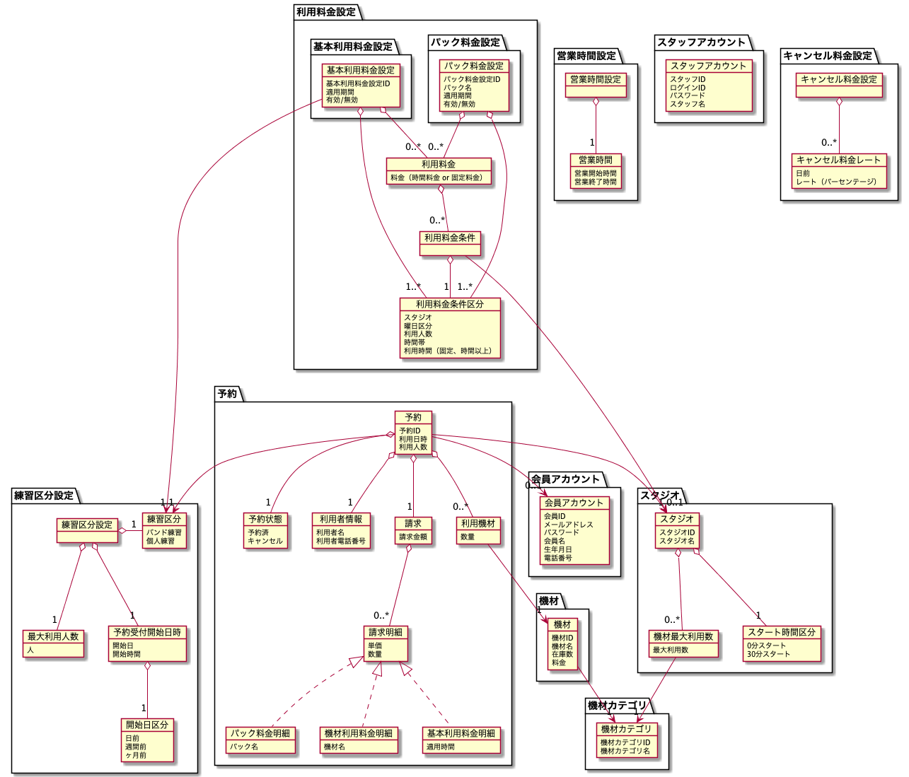

# 概要
スタジオ予約を題材とした DDD の練習プロジェクトです。

要件定義は RADRA 2.0 を参考にしています。

# システムコンテキスト

# 要求モデル
## 要望

## 要件
- スタジオ、機材の空き状況を確認できること。
- スタジオ、機材を予約できること。
- スタジオ、機材の利用料金を計算できること。

# ビジネスコンテキスト
- トップレベルの業務を明らかにする。

# ビジネスユースケース
- ビジネスコンテキストの業務ごとにブレークダウンする。
- ビジネスユースケースが業務フローの単位となる。
- 分割の粒度を調整しながら洗い出す。
- 分割の根拠を明確にする。（業務フローが同じになるような場合は分割しすぎない。）

## 会員管理

- 会員登録
  - 利用者がシステムを利用するための Web で会員登録を行う。
- 会員管理
  - スタッフが会員情報を管理する。

## 予約

- Web予約
  - 利用者が Web で予約する。
- 電話/店頭予約
  - 利用者が電話または店頭で予約する。（スタッフが Web 予約を代行する形になる。）
  - 会員登録していなくても予約できる。

## スタジオ利用

- スタジオ準備
  - スタッフが予約内容を元にスタジオの転換を行う。
- 受付
  - 利用者の予約があるかを確認し、レンタル機材を渡す。
  - 追加のレンタル機材を受け付けることもある。
- スタジオ利用
  - 利用者が実際にスタジオを利用する。
  - スタジオ利用中に追加機材を頼むこともある。  

## 会計

- 会計
  - 利用者が支払いを行う。

## スタッフ管理

- スタッフ管理
  - 管理者がスタッフの管理を行う。 

## 設備管理

- スタジオ管理
  - 管理者がスタジオの管理を行う。
- 機材管理
  - 管理者が機材の管理を行う。
- 利用料金管理
  - 管理者が利用料金の管理を行う。

# 業務フロー/利用シーン
- ビジネスユースケースごとに業務フロー図、利用シーン図を作成し、ユースケースを洗い出す。

## 会員管理
### BUC: 会員登録

### BUC: 会員管理

## 予約
### BUC: Web予約

### BUC: 電話/店頭予約

## スタジオ利用
### BUC: スタジオ準備

### BUC: 受付

### BUC: スタジオ利用

## 会計
### BUC: 会計

## スタッフ管理
### BUC: スタッフ管理

## 設備管理
### BUC: スタジオ管理

### BUC: 機材管理

### BUC: 利用料金管理

# サイト構成

# 画面設計
- 洗い出したユースケースを満たせるようなワイヤーフレームを作っていき、完成イメージを見える化する。

# ドメインモデル
- ドメインモデル図とビジネスルールをまとめていく。

## ドメインモデル図

## 用語集
- ドメインに登場する概念とそれが何を示すかの説明をまとめ、開発者間で認識齟齬が生まれないようにする。（ユビキタス言語を定義する。）

## ビジネスルール
### 予約
- 予約時間の単位は 1 時間
- スタジオごとにスタート時間（0 分スタート、30 分スタート）が決まる
- 練習区分としてバンド練習と個人練習がある。
- 練習区分ごとに最大利用人数を決められる。（個人練習の最大利用人数は 2 名までなど。）
- 練習区分ごとに予約受付開始日時を決められる。（個人練習は前日 21 時から、バンド練習は 2 ヶ月前からなど。）
- スタジオごとに各機材種別の最大利用数を決められる。
- 営業時間を超えた予約を行うことはできない。

##### 会員による Web でのキャンセル
- キャンセル料金がかからない場合のみ可能。
  - キャンセルしたい場合は電話するしかない。
- 利用開始日時を過ぎている場合は不可。

##### スタッフによるキャンセル（管理サイトでのキャンセル）
- TODO

#### 予約の変更について
##### 会員による Web での予約変更
- 変更可否は以下のルールとする。
  - 利用スタジオの変更
    - キャンセル料金が発生しない場合
      - 変更可能。
    - キャンセル料金が発生する場合
      - 変更不可能。
  - 利用日時の変更
    - キャンセル料金が発生しない場合
      - 変更可能。
    - キャンセル料金が発生する場合
      - 時間を増やすことは可能。
      - 時間を減らすことは可能だが、減らした時間分のキャンセル料金が発生する。
      - キャンセル料金は、予約が確定した時点の料金に対して発生する。
      - 例えば、3 時間予約していて後ろの 1 時間減らした場合は、予約確定時の料金の 1/3 の料金に対してキャンセル料金が発生する。
  - 練習区分の変更
    - キャンセル料金が発生しない場合
      - 変更可能。
    - キャンセル料金が発生する場合
      - 個人練習からバンド練習への変更は可能。
      - バンド練習から個人練習への変更は不可能。
  - 利用人数の変更
    - キャンセル料金が発生しない場合
      - 変更可能。
    - キャンセル料金が発生する場合
      - 利用人数が利用料金に関係しない場合
        - 変更可能。
      - 利用人数が利用料金に関係する場合
        - 人数を増やすことは可能。
        - 人数を減らすことは不可能。
  - 利用機材の変更
    - キャンセル料金が発生しない場合
      - 変更可能。
    - キャンセル料金が発生する場合
      - 利用数量を増やすことは可能。
      - 利用数量を減らすことは可能だが、減らした分のキャンセル料金が発生する。
      - キャンセル料金は、予約が確定した時点の料金に対して発生する。
  - 利用者情報は、変更不可能。（会員情報と連携しているためそもそも入力の必要がない。）
- 予約が変更された場合、スタジオ利用料金は再計算する。
- 利用機材が変更された場合は、変更された機材のみ再計算する。（例えば、ギターとベースを予約していて、ギターを 2 本に増やした場合は、ギターの料金のみ再計算する。）
- 利用開始日時を過ぎていた場合は予約の変更はできない。

##### スタッフによる予約変更（管理サイトでの予約変更）
- TODO

### 会員アカウント
- ログインID とパスワードでシステムにログインする。
- パスワードは 8 文字以上 16 文字以内で、半角英数記号がそれぞれ 1 文字以上含まれていなければならない。
- ログインID の重複は許さない。

### スタッフアカウント
- メールアドレスとパスワードでシステムにログインする。
- パスワードは 8 文字以上 16 文字以内で、半角英数記号がそれぞれ 1 文字以上含まれていなければならない。
- メールアドレス の重複は許さない。

### キャンセル料金設定
- 利用日の何日前から何%といったように決められる。
- 最大 50 日前まで指定可能。
- レートは徐々に高くなっていかなければならない。（同じレートは許容する。）
- キャンセル料金例
  | 条件 | キャンセル料金レート |
  | --- | --- |
  | 1 週間前（7 日前）から | 20 % |
  | 前日（1 日前）から | 50 % |
  | 当日（0 日前）から | 100 % |

### 利用料金設定
- 基本利用料金、パック料金を設定できる。
- 基本利用料金について
  - 練習区分ごとに設定できる。
  - 条件として、スタジオ、曜日、時間帯、を指定できる。
  - 基本的に他の設定値との整合性のチェックは行わない。（例えば、営業時間内でしか時間帯条件を設定できない、など。）
  - 他の設定と矛盾する場合、全ての予約条件で料金が導き出せない場合は、登録時にチェックするのではなく、画面に警告を表示する。
- パック料金について
  - バンド練習にのみ適用される。
- バンド練習利用料金例
  |スタジオ|曜日区分|10 - 19|19 - 10|
  |---|---|---|---|
  |Studio A（9 畳）|平日|￥1,000/1h|￥1,500/1h|
  ||土日祭|￥1,500/1h|￥1,500/1h|
  |Studio B（13 畳）|平日|￥1,200/1h|￥1,700/1h|
  ||土日祭|￥1,700/1h|￥1,700/1h|
  |Studio C（15 畳）|平日|￥1,400/1h|￥1,900/1h|
  ||土日祭|￥1,900/1h|￥1,900/1h|
  |Studio D（20 畳）|平日|￥2,000/1h|￥2,500/1h|
  ||土日祭|￥2,500/1h|￥2,500/1h|

- 個人練習利用料金例
  |人数|曜日区分|10 - 19|19 - 10|
  |---|---|---|---|
  |1 名|平日|￥500/1h|￥700/1h|
  ||土日祭|￥700/1h|￥700/1h|
  |2 名|平日|￥800/1h|￥1,000/1h|
  ||土日祭|￥1,000/1h|￥1,000/1h|

- パック料金例（デイパック）
  |スタジオ|曜日区分|利用時間|10 - 19|
  |---|---|---|---|
  |Studio A（9 畳）|平日|3h 以上|￥900/1h|
  |Studio B（13 畳）|平日|3h 以上|￥1,000/1h|
  |Studio C（15 畳）|平日|3h 以上|￥1,200/1h|
  |Studio D（20 畳）|平日|3h 以上|￥1,400/1h|

- パック料金例（オールナイトパック）
  |スタジオ|曜日区分|利用時間|23 - 10|
  |---|---|---|---|
  |全スタジオ|全日|3h 以上|￥4,000|
  |全スタジオ|全日|4h 以上|￥5,000|
  |全スタジオ|全日|5h 以上|￥6,000|
  |全スタジオ|全日|6h 以上|￥7,000|

# レイヤー設計
- [こちら参照](https://github.com/TakashiOnawa/ddd-architecture/blob/main/LayerStructure.md)

# TODO
- 学生のディスカウント。（10 % OFFなど。）
- ポイントカード。
- キャンセル料金未払い検索。

# 参考
- [PlantUML Example for RDRA 2.0 ハンドブック](https://qiita.com/ogomr/items/97058a87337eaa2ba21a)
- [PlantUML で始めるリレーションシップ駆動要件分析 (RDRA)](https://qiita.com/nkenbou/items/86d5718b63f610dfd67f)
- [RDRA2.0 ハンドブック: 軽く柔軟で精度の高い要件定義のモデリング手法](https://www.amazon.co.jp/RDRA2-0-%E3%83%8F%E3%83%B3%E3%83%89%E3%83%96%E3%83%83%E3%82%AF-%E8%BB%BD%E3%81%8F%E6%9F%94%E8%BB%9F%E3%81%A7%E7%B2%BE%E5%BA%A6%E3%81%AE%E9%AB%98%E3%81%84%E8%A6%81%E4%BB%B6%E5%AE%9A%E7%BE%A9%E3%81%AE%E3%83%A2%E3%83%87%E3%83%AA%E3%83%B3%E3%82%B0%E6%89%8B%E6%B3%95-%E7%A5%9E%E5%B4%8E%E5%96%84%E5%8F%B8-ebook/dp/B07STQZFBX)
- [エリック・エヴァンスのドメイン駆動設計](https://www.amazon.co.jp/%E3%82%A8%E3%83%AA%E3%83%83%E3%82%AF%E3%83%BB%E3%82%A8%E3%83%B4%E3%82%A1%E3%83%B3%E3%82%B9%E3%81%AE%E3%83%89%E3%83%A1%E3%82%A4%E3%83%B3%E9%A7%86%E5%8B%95%E8%A8%AD%E8%A8%88-Architects%E2%80%99Archive-%E3%82%BD%E3%83%95%E3%83%88%E3%82%A6%E3%82%A7%E3%82%A2%E9%96%8B%E7%99%BA%E3%81%AE%E5%AE%9F%E8%B7%B5-%E3%82%A8%E3%83%AA%E3%83%83%E3%82%AF%E3%83%BB%E3%82%A8%E3%83%B4%E3%82%A1%E3%83%B3%E3%82%B9/dp/4798121967/ref=pd_sbs_14_5/356-5413493-6590159?_encoding=UTF8&pd_rd_i=4798121967&pd_rd_r=aec16fb5-720a-4960-9f6d-0caf7ec16b51&pd_rd_w=3EeRt&pd_rd_wg=MV9lQ&pf_rd_p=c295905f-82f9-4d73-8142-c393a4211258&pf_rd_r=BNA0M68ZNEPMS2E6H57M&psc=1&refRID=BNA0M68ZNEPMS2E6H57M)
- [実践ドメイン駆動設計](https://www.amazon.co.jp/%E5%AE%9F%E8%B7%B5%E3%83%89%E3%83%A1%E3%82%A4%E3%83%B3%E9%A7%86%E5%8B%95%E8%A8%AD%E8%A8%88-Object-Oriented-SELECTION-%E3%83%B4%E3%82%A1%E3%83%BC%E3%83%B3%E3%83%BB%E3%83%B4%E3%82%A1%E3%83%BC%E3%83%8E%E3%83%B3/dp/479813161X/ref=pd_bxgy_img_2/356-5413493-6590159?_encoding=UTF8&pd_rd_i=479813161X&pd_rd_r=25af8022-aba0-47be-9dca-dc850539071e&pd_rd_w=wK8gF&pd_rd_wg=XlUTt&pf_rd_p=e64b0a81-ca1b-4802-bd2c-a4b65bccc76e&pf_rd_r=SM7DWPBV8CYYH21GJ529&psc=1&refRID=SM7DWPBV8CYYH21GJ529)
- [現場で役立つシステム設計の原則 ~変更を楽で安全にするオブジェクト指向の実践技法](https://www.amazon.co.jp/%E7%8F%BE%E5%A0%B4%E3%81%A7%E5%BD%B9%E7%AB%8B%E3%81%A4%E3%82%B7%E3%82%B9%E3%83%86%E3%83%A0%E8%A8%AD%E8%A8%88%E3%81%AE%E5%8E%9F%E5%89%87-%E5%A4%89%E6%9B%B4%E3%82%92%E6%A5%BD%E3%81%A7%E5%AE%89%E5%85%A8%E3%81%AB%E3%81%99%E3%82%8B%E3%82%AA%E3%83%96%E3%82%B8%E3%82%A7%E3%82%AF%E3%83%88%E6%8C%87%E5%90%91%E3%81%AE%E5%AE%9F%E8%B7%B5%E6%8A%80%E6%B3%95-%E5%A2%97%E7%94%B0-%E4%BA%A8/dp/477419087X)
- [ドメイン駆動設計入門 ボトムアップでわかる! ドメイン駆動設計の基本](https://www.amazon.co.jp/%E3%83%89%E3%83%A1%E3%82%A4%E3%83%B3%E9%A7%86%E5%8B%95%E8%A8%AD%E8%A8%88%E5%85%A5%E9%96%80-%E3%83%9C%E3%83%88%E3%83%A0%E3%82%A2%E3%83%83%E3%83%97%E3%81%A7%E3%82%8F%E3%81%8B%E3%82%8B-%E3%83%89%E3%83%A1%E3%82%A4%E3%83%B3%E9%A7%86%E5%8B%95%E8%A8%AD%E8%A8%88%E3%81%AE%E5%9F%BA%E6%9C%AC-%E6%88%90%E7%80%AC-%E5%85%81%E5%AE%A3/dp/479815072X/ref=pd_bxgy_img_3/356-5413493-6590159?_encoding=UTF8&pd_rd_i=479815072X&pd_rd_r=25af8022-aba0-47be-9dca-dc850539071e&pd_rd_w=wK8gF&pd_rd_wg=XlUTt&pf_rd_p=e64b0a81-ca1b-4802-bd2c-a4b65bccc76e&pf_rd_r=SM7DWPBV8CYYH21GJ529&psc=1&refRID=SM7DWPBV8CYYH21GJ529)
- [ドメイン駆動設計 モデリング/実装ガイド](https://booth.pm/ja/items/1835632)

# 気づき
## ファーストクラスコレクション
- ファーストクラスコレクション自体も不変にする。（内部も ValueObject にする。）
  - Entity をファーストクラスコレクションにしたい場合はどうする？
- ファーストクラスコレクション自体ののバリデーションは、コンストラクタでは行わず、集約ルートに任せた方が良い？

## プレゼンテーション層にドメインオブジェクトを公開するか
- コントローラーがドメインオブジェクトを利用してユースケースを組み立てることを基本と考え、アプリケーションサービスに処理をまとめるとより分かりやすいよ、というくらいの感覚で良いように思う。
- そう考えると、プレゼンテーション層にもドメインオブジェクトを公開することになるし、アプリケーションサービスの I/F も DTO ではなくドメインオブジェクトとするのが良いように思う。
- 注意点としては、ドメインオブジェクトにドメイン以外の処理（画面固有の処理など）を含めないようにすること。
- ドメインサービスからリポジトリ呼び出しはさせない、という考えにも繋がっていく気がする。

## バリデーション
- ドメインオブジェクト内で実施するバリデーションをどのように通知するか
  - ドメインオブジェクト内でドメイン例外をスローするパターン
    - ドメインのメソッドが画面の入力単位に引きずられる恐れがある。
    - なぜなら、一度の操作で複数のバリデーションを行う場合は、エラーの内容を全て画面に出したいことが多いように思う。
    - ドメインオブジェクトのメソッドを変更する値毎に区切った場合、メソッド毎に例外がスローされるため、全てのエラーを画面に通知することができない。
    - よって、画面の入力全てを一度に変更するメソッドをドメインオブジェクトに用意する必要がある。
    - もし、画面の入力単位が変わった場合、ドメインオブジェクトのメソッドも変更しなければならなくなってしまう。つまり、画面の変更がドメインに波及してしまうことになる。
  - ドメインオブジェクトはエラー通知オブジェクトを返すパターン
    - ドメインのメソッドは、変更する値毎に用意する。（ドメインとして意味のある単位で作成するのがベスト。）
    - ドメインのメソッドの引数に通知オブジェクトを渡す。
    - ドメインのメソッド内で発生したバリデーションはエラー通知オブジェクトに詰める。
    - 呼び出し元は、ドメインオブジェクトのメソッドを個別に呼び出し、最終的にエラー通知オブジェクトに値があれば例外をスローする。
    - このようにすることで、画面の入力単位が変わったとしてもドメインオブジェクトを変更する必要がなくなる。
  - では、インスタンス作成時のバリデーションはどうなるだろうか？
    - ユースケースに依存せざるを得ないかもしれない。
    - 生成する必要最低限の値のみで生成し、その他の値はメソッド呼び出しで設定していくやり方だと、生成時のバリデーションに引っかかった時にインスタンスが生成されないため、その後のメソッド呼び出しができないことになり、生成時のバリデーション結果のみが画面に通知されることになる。
    - なので、新規作成の単位が変わるたびにオーバーロードのファクトリメソッドを増やしていくのが良いかもしれない。
    - そして、新規生成のファクトリメソッドは、エラー通知オブジェクトを利用するというよりも内部でスローしてしまって良いと思う。
    - なぜなら、インスタンスが生成できないと何も始まらないから。
